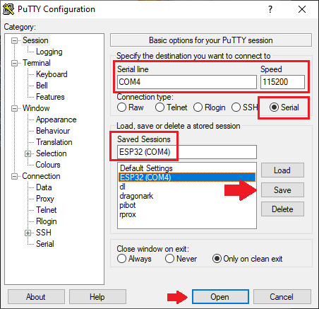
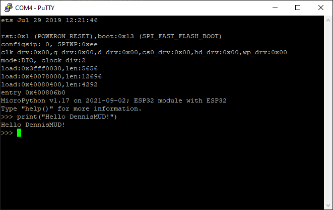

# Getting Started with Micropython on ESP32

## Requirements

- Python 3.X
- ESP32 Dev Board

## Getting Started

### Identify Your Dev Board

First, identify your dev board to the best of your ability. The ESP32's come in a number of different flavors such as
vanilla ESP32, ESP32 with SPIRAM, ESP32-S2, S3, etc. This may be difficult but if you can't determine the exact ESP32
you're dealing with, assume vanilla ESP32.

### Identify Device on OS

Plug in the device to your computer via USB and look for new COM ports in Device Manager for Windows or look for
/dev/ttyUSB0 and other devices in linux. In linux if you want more specific information on a particular USB device you
can run `udevadm info --name=/dev/ttyUSB0 --attribute-walk` to get mor details and identify your device.

You may also need to install drivers if you're working in Windows. For espressif (the most common ESP32 vendor) you can
find drivers [here](https://www.silabs.com/developers/usb-to-uart-bridge-vcp-drivers), but in general check your
chip-vendor specific page.

### Download Your ESP32 Firmware

Go to the [micropython firmware download site](https://micropython.org/download/#esp32) and download the latest
firmware for your specific version to the firmware directory.

### Create a Virtual Environment - OPTIONAL

As an optional step create a virtual environment and activate it at this point to keep your system installation of
python clean while you install esptool.

```bash
# Windows (Powershell)
python -m venv venv
.\venv\Scripts\Activate.ps1

# Linux (may require install of python3-venv)
python3 -m venv venv 
source venv/bin/activate
```

### Flash Micropython to Your Dev Board

Follow [this tutorial](https://docs.micropython.org/en/latest/esp32/tutorial/intro.html) to flash your ESP32 with
micro-python.

In short you'll install esptool, erase the flash, then deploy the firmware like so:

```bash
# Windows (Powershell)
pip install esptool
esptool.py.exe --port COM4 --chip esp32 erase_flash
esptool.py.exe --chip esp32 --port COM4 write_flash -z 0x1000 firmware\esp32-20210902-v1.17.bin

# Linux
esptool.py --port /dev/ttyUSB0 erase_flash
esptool.py --chip esp32 --port /dev/ttyUSB0 write_flash -z 0x1000 esp32-20210902-v1.17.bin
```

### Connect to Micropython

The flashing process should restart your device so leave it plugged in. Next you can connect to it with putty to get
a prompt:





For linux you can simply use screen to connect to it:

```bash
# sudo apt install screen -y
screen /dev/ttyUSB0 115200
```

### Copy a Python File to the ESP32

Running and copying code to your ESP32 is done via the python tool ampy. To copy, run, and update code on the ESP32
first install ampy:

```bash
# Windows (Powershell)
pip install adafruit-ampy --upgrade

# Linux
pip3 install adafruit-ampy --upgrade
```

Once installed you can run ampy to execute code in the micropython shell:

```bash
# Windows (Powershell)
ampy.exe --port COM4 run --no-output .\src\test.py

# Linux
ampy --port /dev/ttyUSB0 run --no-output src/test.py
```

In both the above examples you can CTRL-C to quit. Should get output similar to the following:

```bash
Hello world! I can count:
1
2
3
4
5
...
```

Note that this does NOT move the code over to the ESP32. To do that you would use the PUT command:

```bash
# Windows (Powershell)
ampy.exe --port COM4 put src\test.py

# Linux
ampy --port /dev/ttyUSB0 put src/test.py
```

The put command can put individual files or entire directories. So alternatively you could run:

```bash
# Windows (Powershell)
ampy.exe --port COM4 put src

# Linux
ampy --port /dev/ttyUSB0 put src
```

The above copies the entire src directory to the micropython file system. Ampy supports many other commands such as
`ls`, `rm`, `get`, etc. For more info run `ampy --help` or checkout
[the ampy github page](https://github.com/scientifichackers/ampy).

### Running a Main App

Once you have code you want your device to run at boot, you simply need to put it on the microcontroller as `main.py`.
On boot the microcontroller will run this script and output will be accessible via serial terminal.

```bash
# Windows (Powershell)
ampy.exe --port COM4 put src\test.py main.py

# Linux
ampy --port /dev/ttyUSB0 put src\test.py main.py
```

### Final Thoughts

This is the basics of getting started with micropython on ESP32. One thing to keep in mind is that micropython is NOT a
full python kernel and has specific standard libraries that are different from standard python. For more information
check out the links below:

- [MicroPython libraries](https://docs.micropython.org/en/latest/library/index.html)

Additionally at any point you can follow the initial commands used to erase the flash and reflash it if your deployed
code gets untenable. Ideally try to develop your micropython app to leverage scripts to automate the deployment process
so all one has to do is identify the COM port for their device, run a script, and connect to use the application.
